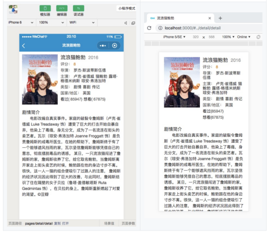

## Omi 跨端云开发

| **ProjectName**                         | **Description**                           |
| ------------------------------- | ----------------------------------- |
| omip| 直接使用 Omi 开发小程序或 H5 SPA|
| [mps](https://github.com/Tencent/omi/tree/master/packages/mps)| 【原生小程序】增强的小程序开发框架(JSX+Less 输出 WXML+WXSS) |
| [mps-cloud](https://github.com/Tencent/omi/tree/master/packages/mps#mps-cloud)| 【原生小程序云开发】小程序插上 JSX、Less 和 Cloud 的翅膀 |
| [omi-cloud](https://github.com/Tencent/omi/tree/master/packages/omi-cloud)| Omip + 小程序•云开发|
| [omix](https://github.com/Tencent/omi/tree/master/packages/omix)| 【原生小程序】极小却精巧的小程序框架|
| [omi-mp](https://github.com/Tencent/omi/tree/master/packages/omi-mp)| 【原生小程序】通过微信小程序开发和生成 Web 单页应用(H5 SPA)|
| [comi](https://github.com/Tencent/omi/tree/master/packages/comi)| 小程序代码高亮和 markdown 渲染组件 |


## Omip

使用 Omi 开发小程序或 H5 SPA

> 现在，Omi 不仅仅可以开发桌面 Web、移动 H5，还可以直接开发小程序！

* Write Once, Run Anywhere
* Learn Once, Write Anywhere


## Omip 特性

* 一次学习，多处开发，一次开发，多处运行
* 使用 JSX，表达能力和编程体验大于模板
* 支持使用 npm/yarn 安装管理第三方依赖
* 支持使用 ES6+
* 支持使用 CSS 预编译器
* 小程序 API 优化，异步 API Promise 化
* 超轻量的依赖包，顺从小程序标签和组件的设计
* 支持[→ 小程序•云开发](https://github.com/Tencent/omi/tree/master/packages/omi-cloud)


## 快速开始

```js
npm i omi-cli -g
omi init-p my-app
cd my-app
npm start        //开发小程序
npm run dev:h5   //开发 h5
npm run build:h5 //发布 h5
```
> node 版本要求 >= 8

> 也支持一条命令 `npx omi-cli init-p my-app` (npm v5.2.0+)

把小程序目录设置到 dist 目录就可以愉快地调试了！

也可以初始化 TypeScript 模板项目:

```js
omi init-p-ts my-app
```

> 也支持一条命令 `npx omi-cli init-p-ts my-app` (npm v5.2.0+)

## 代码示例

```js
import { WeElement, define } from 'omi'
import './index.css'

define('page-counter', class extends WeElement {
  config = {
    navigationBarTitleText: 'Counter'
  }

  data = {
    count: 1
  }

  sub = () => {
    this.data.count--
    this.update()
  }

  add = () => {
    this.data.count++
    this.update()
  }

  render() {
    return (
      <view>
        <button onClick={this.sub}>-</button>
        <text>{this.data.count}</text>
        <button onClick={this.add}>+</button>
      </view>
    )
  }
})
```

## 扩展

`this.update` 方法可以传递最短路径，进行更新，比如下面两种写法是等价的。

```js
this.update({
  count: 1
})
```

等价于:

```js
this.data.count = 1
this.update()
```

也可以和 setData 一样传递 path:

```js
this.update({
  'list[1].obj.name': 'Omip'
})
```

由于小程序视图更新是异步的，如果需要获取视图更新后的回调，可以使用第二个参数:

```js
this.update({
  'list[1].obj.name': 'Omip'
}, () => {
  console.log('更新完成')
})
```

或者只有一个参数，且该参数为函数:

```js
this.update(() => {
  console.log('更新完成')
})
```

## 注意事项

在 JSX 或者一些要使用图片资源的 API，需要使用 import 或者 require 先导入图片再使用，不能直接使用相对地址！

如：

```js
 onShareAppMessage(){
		return {
      title: '分享标题',
      path: '/pages/index/index?id=123',
      imageUrl: require('./share.jpg'),
      success: (res) => {
        console.log("转发成功", res);
      },
      fail: (res) => {
        console.log("转发失败", res);
      }
    }
  }
```

再比如:

```jsx
import src from './my-image.png'
...
...


  render() {
    return (
      <view>
        <image src={src}></image>
      </view>
    )
  }
...
...

```

## 访问原生小程序里的 this

```js
this.$scope
```

## 获取最新的 omip 版本

你只需要重新拉去模板便可以更新到最新的 omip:

```
omi init-p my-app
```

## 实战案例




## License

MIT © dntzhang

#### Open Source Software Licensed Under the MIT License:

[tarojs](https://github.com/NervJS/taro) 1.2.13
Copyright (c) 2019 O2Team
